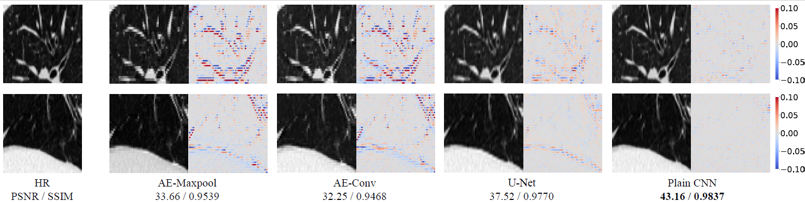
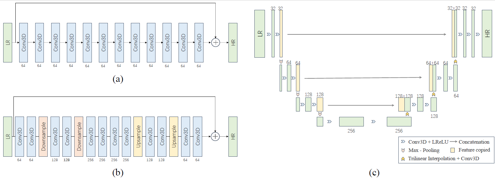

# Is Autoencoder Truly Applicable for 3D CT Super-Resolution?

<p align='center'>
  
</p> 

> **Is Autoencoder Truly Applicable for 3D CT Super-Resolution?**<br>
> Weixun Luo, Xiaodan Xing, Guang Yang<br>
> ISBI 2023
> 
> **Abstract**: <br>
> Featured by a bottleneck structure, autoencoder (AE) and its variants have
> been largely applied in various medical image analysis tasks, such as
> segmentation, reconstruction and de-noising. Despite of their promising
> performances in aforementioned > tasks, in this paper, we claim that AE models
> are not applicable to single image super-resolution (SISR) for 3D CT data. Our
> hypothesis is that the bottleneck architecture that resizes feature maps in AE
> models degrades the details of input images, thus can sabotage the performance
> of superresolution. Although U-Net proposed skip connections that merge
> information from different levels, we claim that the degrading impact of
> feature resizing operations could hardly be removed by skip connections. By
> conducting large-scale ablation experiments and comparing the performance
> between models with and without the bottleneck design on a public CT lung
> dataset, we have discovered that AE models, including U-Net, have failed to
> achieve a compatible SISR result (p < 0.05 by Student’s t-test) compared to
> the baseline model. Our work is the first comparative study investigating the
> suitability of AE architecture for 3D CT SISR tasks and brings a rationale for
> researchers to re-think the choice of model architectures especially for 3D CT
> SISR tasks.


## Description
This repository contains the official PyTorch implementation of [Is Autoencoder
Truly Applicable for 3D CT Super-Resolution?](https://ieeexplore.ieee.org/document/10230786)
We have provided our full codes and pre-trained models here.


## Get Started
### Virtual Environment
To install the environment, please clone the repository and run the following
commands:

```shell script
conda env create -f environment.yml
conda activate 3DSuperResolution
```

### Dataset
To use a customised dataset, please provide a dataset loading file as **.csv**
and modify `DATASET_LOADING_FILE_PATH` in
[path_configuration.py]('./configuration/path_configuration.py'). This loading
file should contains the following columns:

- `path`: A **str** that specifies the path of a 3D image
- `tag`: A **str** that specifies the subset, one of `train`/`validation`/`test`.

We have also provided a [sample loading file]('./dataset/sample_loading_file.csv')
as demonstration.


## Train Models on Customised Datasets
To train models on customised datasets, please run the following command:

  ```shell script
  python train.py --model_name <model_name>                         \
                  --upsample_name <upsample_name>                   \
                  --output_directory_path /path/to/output_directory \
                  --is_resuming                                     \
                  --epoch <epoch>                                   \
                  --batch_size <batch_size>                         \
                  --patch_size <patch_size>                         \
                  --scale_factor <scale_factor>                     \
                  --learning_rate <learning_rate>                   \
                  --window <window>                     
  ```

  - `model_name`: A **str** that specifies the name of the model, 
  `PlainCNN`/`AE_Maxpool`/`AE_Conv`/`UNet`.
  - `upsample_name`: A **str** that specifies the name of the upsampling method
  used in low-resolution data generation, `trilinear_interpolation`/
  `same_insertion`.
  - `output_directory_path`: A **str** that specifies the directory to store
  model weigths and record.
  - `is_resuming`: Only add this if resuming from the last training.
  - `epoch`: An **int** that specfies the number of epochs.
  - `batch_size`: An **int** that specifies the number of data in one batch.
  - `patch_size`: An **int** that specifies the size of cubic patches.
  - `scale_factor`: An **int** that specifies the scale_factor of downsampling/
  upsampling in the z-axis, `2`/`4`/`8` used in the paper.
  - `learning_rate`: A **float** that specifies the step size in gradient
  updating.
  - `window`: A **tuple[int|None, int|None]** that specifies the range of
  HU values interested.

We have provided the following models:

  - `PlainCNN`: A cascade of (Conv3D + LeakyReLU) blocks + global residual
    learning
  - `AE_Maxpool`: Use PlainCNN as baseline and Maxpooling as downsampling
    method.
  - `AE_Conv`: Use PlainCNN as baseline and strided Conv3D as downsampling
    method.
  - `UNet`: A simplified 3D UNet implementation for fair comparisons.

<p align='center'>
  
</p> 


## Test Models on Customised Datasets
To test trained models on customised datasets, please run the following command:

  ```shell script
  python test.py --model_name <model_name>                \
                 --upsample_name <upsample_name>          \
                 --weight_file_path /path/to/model_weight \
                 --scale_factor <scale_factor>            \
                 --window <window>
  ```

  - `model_name`: A **str** that specifies the name of the model, 
  `PlainCNN`/`AE_Maxpool`/`AE_Conv`/`UNet`.
  - `upsample_name`: A **str** that specifies the name of the upsampling method
  used in low-resolution data generation, `trilinear_interpolation`/
  `same_insertion`.
  - `weight_file_path`: An **str** that specifies the file that stores model
  weights.
  - `scale_factor`: An **int** that specifies the scale_factor of downsampling/
  upsampling in the z-axis, `2`/`4`/`8` used in the paper.
  - `window`: A **tuple[int|None, int|None]** that specifies the range of
  HU values interested
